# USER GUIDE

# Experimental Trials

1.  Select the file **experimental_trial.csv** located in **Assets/Resources/**.

2.  This file contains all the information about the trials and will allow you to choose the necessary options.

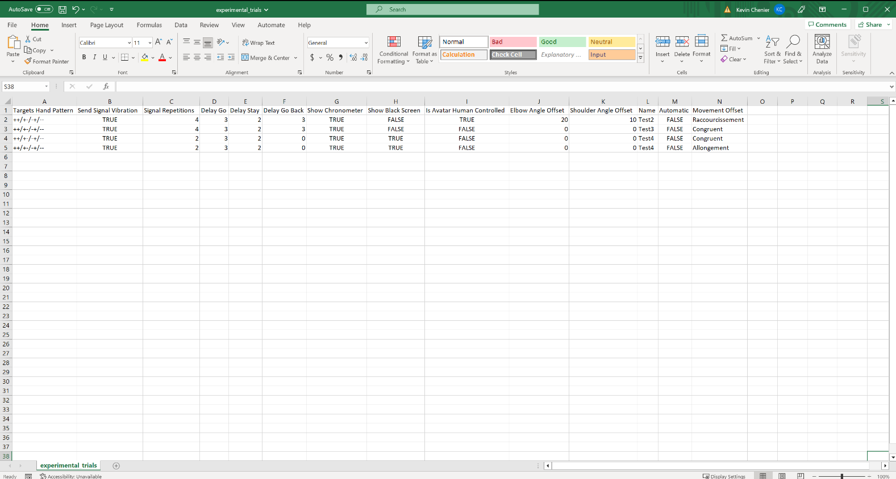

1.  **Targets Hand Pattern** :
    -   This option allows you to choose the set of targets you want to show to the participant. You can select the desired number of targets.
    -   The possible choices are: "++", "+-", "-+", "--" (please refer to the "visualisation_combinaison.xlsx" file to see what these choices correspond to).
    -   The targets should be separated by the "**/**" character. For example, ++**/**-+**/**+-**/**--.
    -   **Attention** : The CSV file will give you an error if you enter only the pattern without starting it with an apostrophe character "**‘**".

        

        To resolve this, please add an apostrophe and press Enter.

        

2.  **Send Signal Vibration :**
    -   This option allows specifying to the application to ensure that Arduino sends signals at the right time for LabVIEW.
    -   The possible choices are: TRUE, FALSE.
    -   **Attention**: It is important that the characters remain in **uppercase**.
    -   The pin responsible for sending the signal is **pin 7 (Digital - 07)**.

        

2.  **Signal Répétitions :**
    -   This option specifies the number of signal repetitions that will be sent by the Arduino.
    -   Possible choices are : [0, ∞[.
    -   **The actual number of signals sent will be determined by the number of targets specified in the "Targets Hand Pattern" if it exists.**

        **Exemples :**

        -   The signal will be sent **4 times**.

            

        -   The signal will be sent **4 times**.

            

        -   The signal will be sent **2 times**.

            

        -   The signal will be sent **4 times**.

            

3.  **Delay go :**
    -   This option specifies the time in seconds for the "move towards the target" motion.
    -   The green bar of the timer will progress throughout this time.
    -   Possible choices are : [0.0, ∞[.
4.  **Delay stay :**
    -   This option specifies the time in seconds that the participant must stay on the target.
    -   The timer will be visible, however, the green bar will be hidden, indicating to the participant to stay on the target.
    -   Possible choices are : [0.0, ∞[.
5.  **Delay Go Back :**
    -   This option specifies the time in seconds that the participant has to return to the initial target.
    -   The timer will disappear once this time has elapsed.
    -   Possible choices are : [0.0, ∞[.
6.  **Show chronometer**
    -   This option specifies whether we want the timer to be visible or not. It is recommended to keep it visible because otherwise the patient will not have feedback for the timing.
    -   Possible choices are : TRUE, FALSE.
    -   **Attention**: It is important that the characters remain in **uppercase**.
7.  **Show Black Screen :**
    -   This option allows hiding the display in the virtual reality headset so that the participant does not see anything during the experience, with a black screen displayed instead.
    -   It should be noted that the experimenter will be able to see what is projected on the screen while the participant will not see anything.
8.  **Is Avatar Human Controlled :**
    -   This option allows the program to control the avatar automatically.
    -   Possible choices are : TRUE, FALSE.
    -   **Attention**: It is important that the characters remain in **uppercase**.
9.  **Elbow Angle Offset :** « Hand overshoot »
10. **Shoulder Angle Offset :** «Elbow overshoot»
    -   These options determine the maximum angle of overshoot or offset that will be applied to the virtual avatar.
    -   Possible choices are : [0.0, ∞[.
    -   System explication :

            A = min(D1/D2 * B, 1)

A = Angle of overshoot or "offset" of the hand

D1 = The distance between the **actual position of the hand (represented by the controller)** and **the resting hand position**.

D2 = The distance between **the resting hand position** and **the selected target position**.

B = The value of **"Elbow Angle Offset"** determined in the **experimental_trial.csv** file.

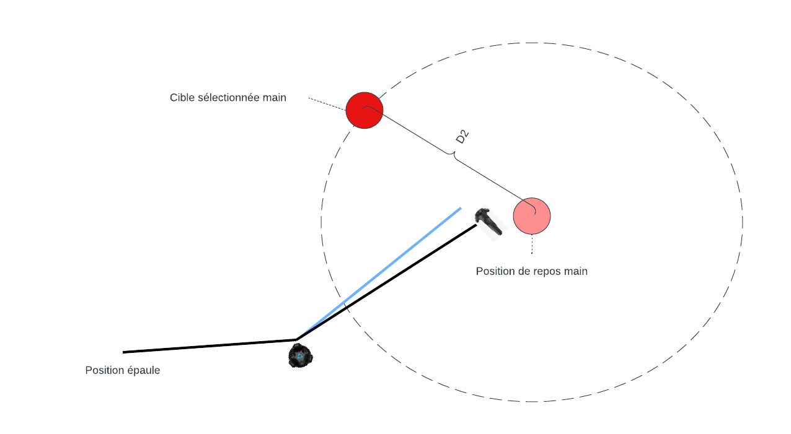

So, the further we move away from the resting position, the closer the overshoot angle will approach **B**. For example, if the actual hand position is at 10% of the distance D2, then D1/D2 = 0.1 so the overshoot angle will be 0.1 \* **B**, which is 10% of the **Elbow Angle Offset**. If D1 \> D2, it means that the actual hand position has exceeded the perimeter of the circle with radius  D2, and in this case, the value 1 will be chosen, indicating that we want **B**, which is 100% of the **Elbow Angle Offset**.

\*The light blue line represents the position of the avatar, while the black lines represent the actual positions of the person. The angle is formed by the angle between the blue line (avatar forearm) and the black line (actual person's forearm).

\*This approach is also valid for determining the angle of overshoot or offset for the elbow. The angle will be the value of the **Shoulder Angle Offset** determined in the **experimental_trial.csv** file.

New system that takes into account a factor for the joint angle :

                A = min(D1/D2 * B, 1) ----------> A = x * a

A = Angle of overshoot or "offset" of the hand

x = The distance between the **actual position of the hand (represented by the controller)** and **the resting hand position** in degrees.

a = The value for the factor of the joint angle determined in the **experimental_trial.csv** file.

11.  **Name :**
    -   This option allows naming the current trial.
    -   Any sequence of characters is possible for this option.
12.  **Automatic :**
    -   This option allows the experimenter to have a waiting option when a repetition (such as a selected target) is completed. A text will appear indicating to the participant and the experimenter that the application is waiting for a key press.
    -   Pressing the "space" key on the keyboard allows the experimenter to proceed to the next repetition.
    -   The possible choices are: TRUE, FALSE. If you want a waiting time between repetitions, you should choose FALSE.
    -   **Attention**: It is important that the characters remain in **uppercase**.
13.  **Movement Offset :**
    -   This option determines the overshoot or offset of the hand or elbow. The combination of Movement Offset and the values of Elbow Angle Offset and Shoulder Angle Offset will help properly position the overshoot angles.
    -   The possible choices are : Raccourcissement, Congruent, Allongement.

# Combination Visualization

1.  Select the file **visualisation_combinaison.xlsx** located in **Assets/Resources/**.
2.  This file contains the necessary information to accurately position the targets in the 3D environment.

3.  To change the measurement values for the participant's arm and forearm, you need to modify the values highlighted in yellow. For example, if the forearm measures 36 centimeters, you should enter 0.36 in the cell.

4.  To change the participant's dominant hand and ensure that the targets are placed on the correct side of the participant, you simply need to modify the value in the next cell.

5.  When you modify the arm measurements and dominant hand, the graph will update and show you the new positions of the targets. **The shoulder position corresponds to the original position**. The values indicated in the CSVforUnity worksheet will also be updated. **Attention: it is now important to follow the instructions carefully to transfer the data to Unity correctly.**
    1.  Select the worksheet named **CSVforUnity**.
    

    2.  This page will be displayed. **Attention: do not change the values in this worksheet. Only modify the important values in the XLSX worksheet.**
    

    \*The values of Arm Position "pointR", "pointPP", etc. correspond to the values indicated in the graph of the XLSX worksheet. For example, the point R for the Body Part "hand" corresponds to the position indicated by "Hand ++", and the point PP for the Body Part "elbow" corresponds to the position indicated by "Elbow +- and ++". The x and z values will correspond to the Unity positions for that specific point.
    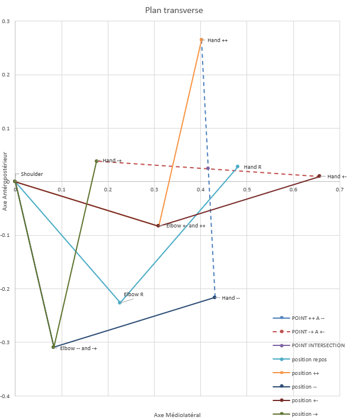

    3.  Press the "File" tab.
    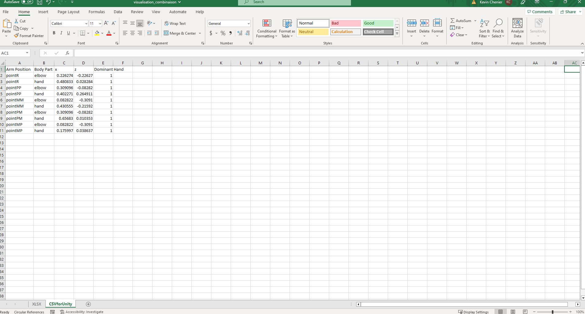

    4.   Press the "Save As" tab.
    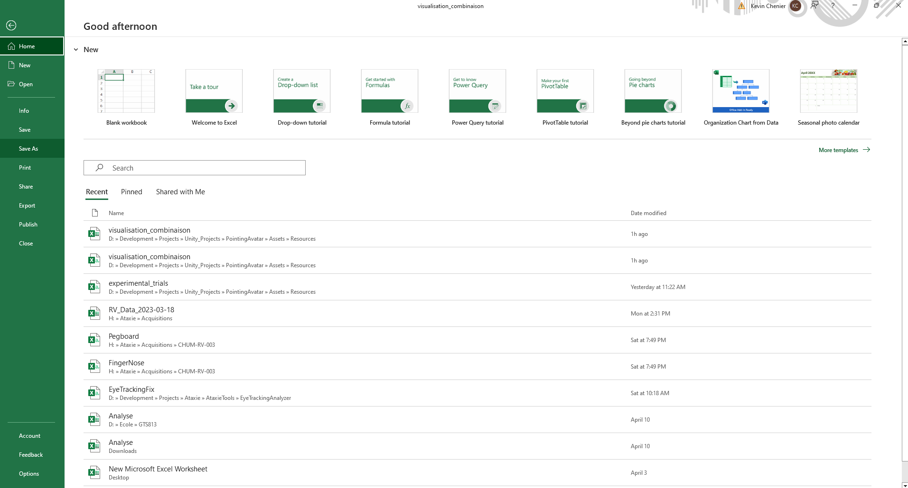

    5.  Select the saving options.
    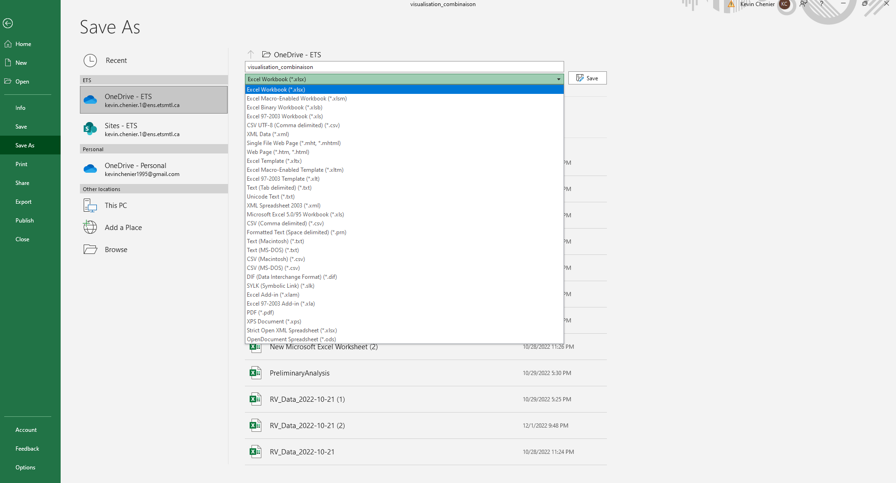

    6.  Select the CSV (Comma delimited) option (*.csv) and click on "Save."
    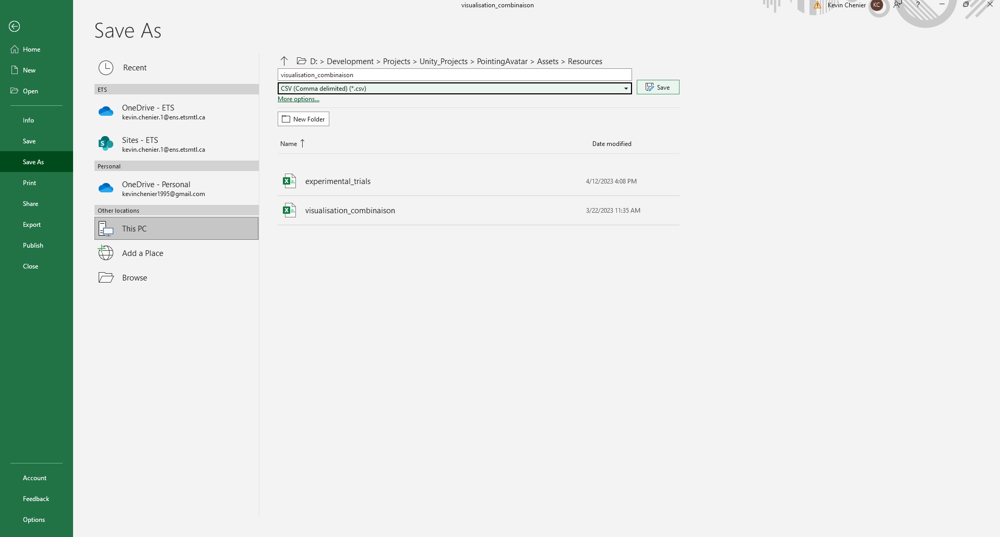

    7.  Click on "OK" if the file already exists.
    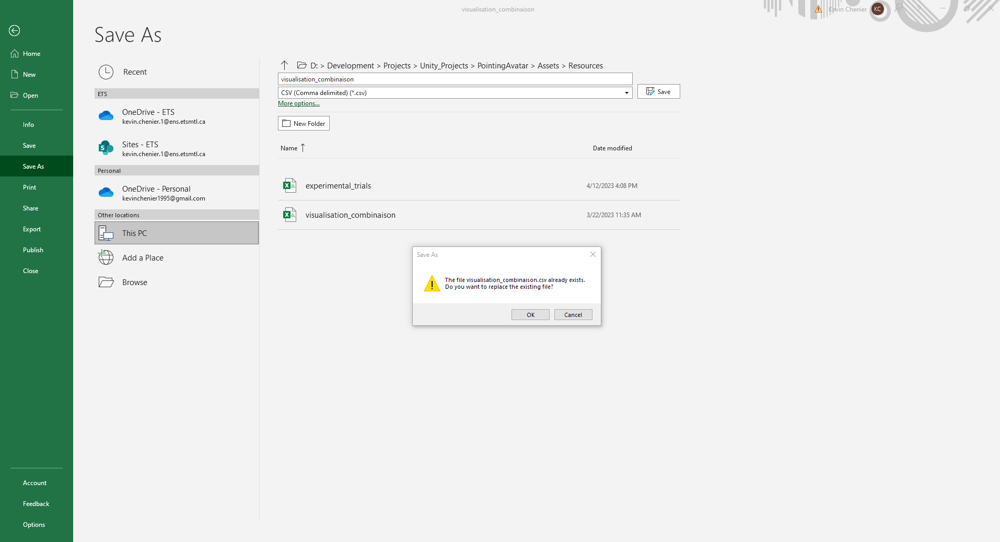

    8.  Click on "OK" again.
    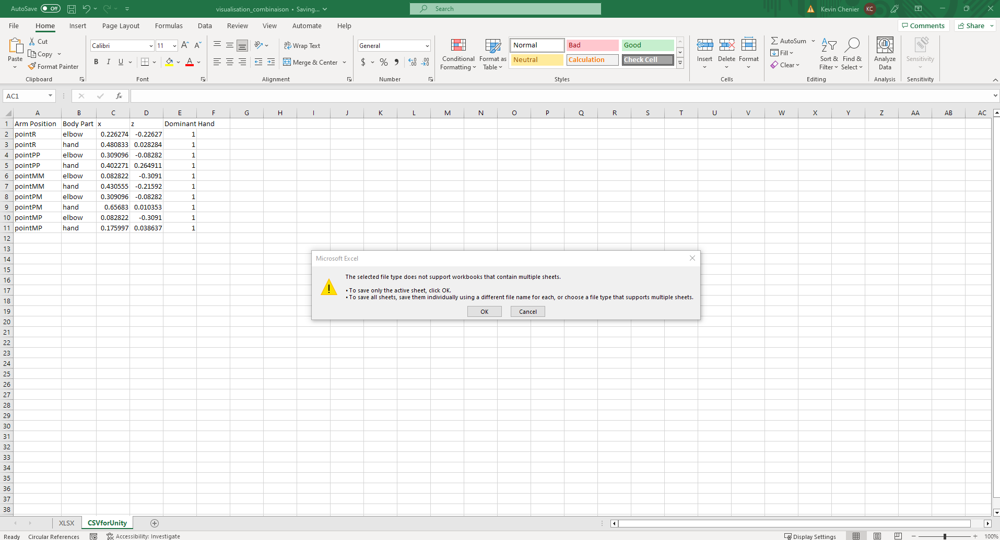

    9.  Click on the "x" button to close the document. The "Save" option will still be displayed, so click on it again. **It is important to close the document before proceeding.**
    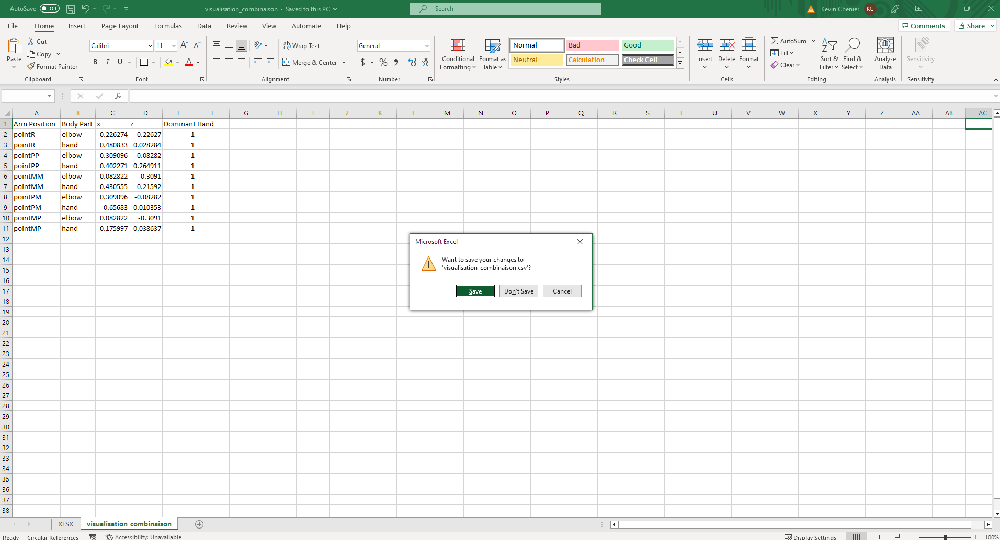

# Unity

*\*When it is mentioned to press a mouse button **in the scene**, this implies that the visual representation of the mouse should be within the window that contains the scene, as if you wanted to have the focus on the application.*

1.  Select **Unity 2021.3.4f1.**
2.  **Select the project PointingAvatar.**
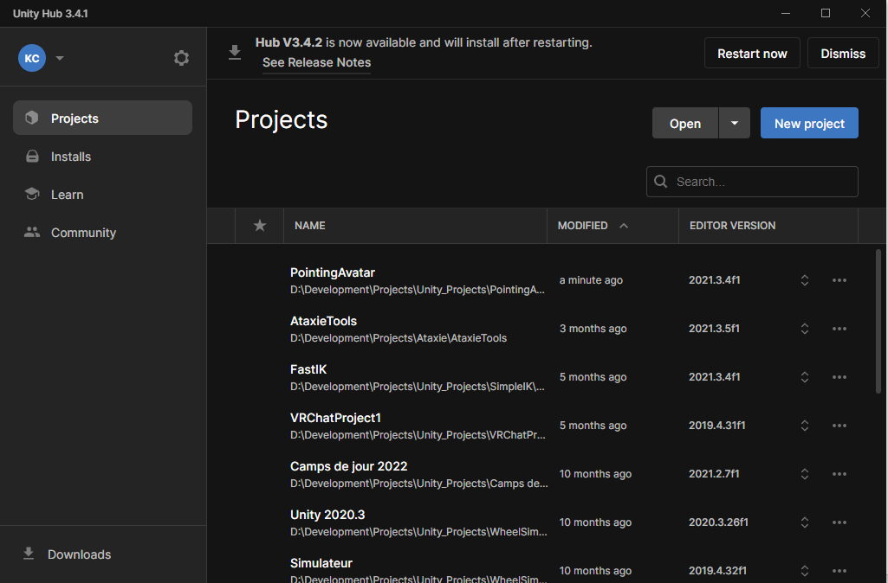
3.  Press on **"Play".**
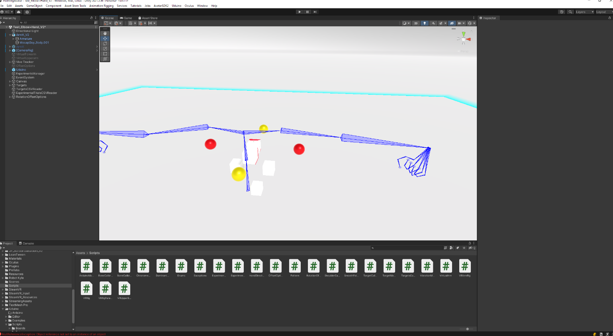
4.  This screen will appear. Press the following keys exactly in this order:
    1.  Click the left mouse button **in the scene.**
    2.  « C » on the keyboard **for calibration**
    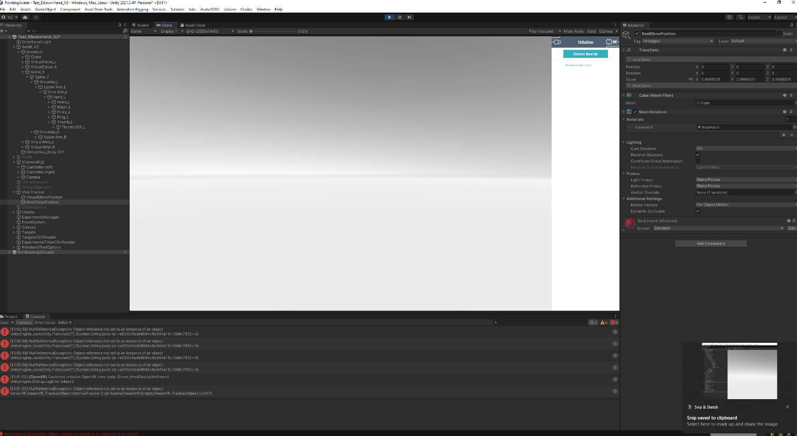

    This option will place the targets in the scene according to the specified configuration in the file "visualisation_combinaison.xlsx". Please click on the "Scene" tab, and then you can right-click in the scene **(focus has to be on the game)**, move using W A S D, and use the mouse to navigate within the scene. The scroll wheel can be used to change the movement speed.
    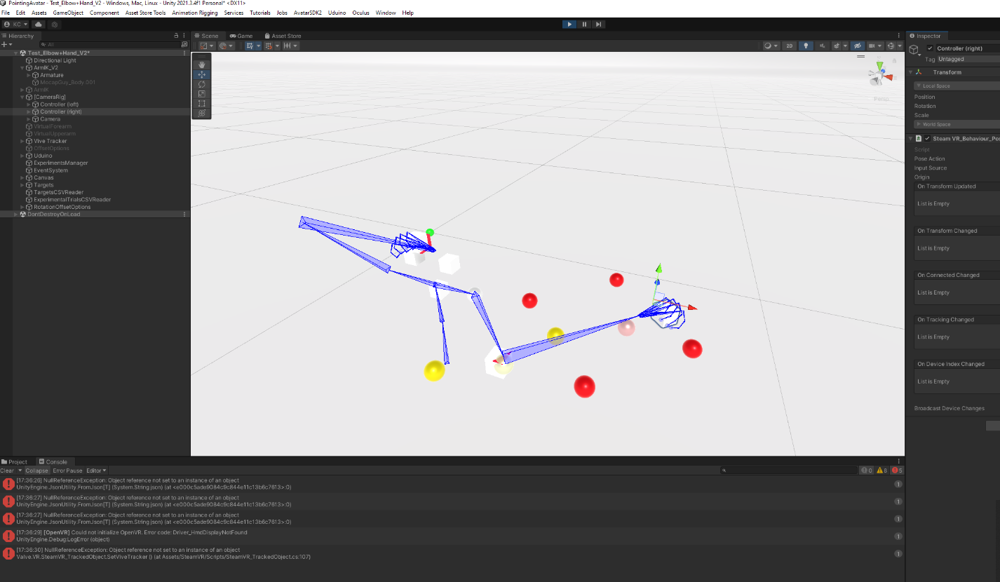

5.  Now, click on the "Game" tab. You will return to the view from step 4. Please click the left mouse button in the scene **(focus has to be on the game)**, and then press the "Space" key on the keyboard. This key will activate the repetitions to be performed.

6.  If you have set the option to FALSE for "Automatic" in the "experimental_trial.csv" file, you will see the text "Waiting..." when the repetition is completed. This means that you can press the "Space" key on the keyboard again.
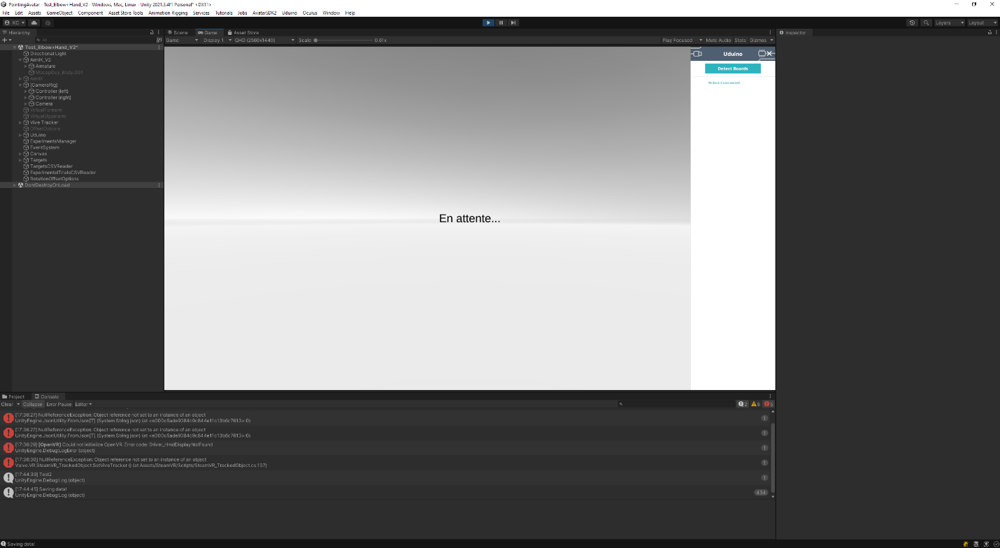
